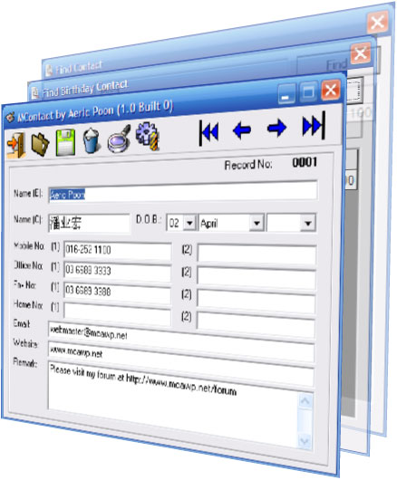



## MContact \(Telephone Directory with Birthday Search\)

### Description

Basically it is just a telephone numbers directory. You can search for people whose birthdays are fall inside a range of Date so that you could call/send SMS to them to wish them :-). Support Chinese name as other name. Use MS Access 2000 database with password protected. Auto compact database and update birthday when unloading the program. Auto resize MSFlexgrid column width when vertical scrollbar appeared. Use text file for simple program settings and write error log. Easy to use First, Previous, Next and Last records and string Find function. Easy to Add, Save, Edit/Update and Delete records using Hotkeys.

Updated 12 October 2007: Leap year bug fixed and also show age in MSFlexgrid. Support empty birth date whether only Day or Month or Year is inserted or combination of 2 or 3 entries. Use Dateserial function to fix date problem.

P/S: Searching birthday records stored inside a database is not easy. I hope this program could help someone who are looking for an idea to solve the problem.
 
### More Info
 
This program connect to MS Access 2000 with password using ADO.

             |
---                |---
**Submitted On**   |2007-10-12 05:30:02
**By**             |[Aeric](https://github.com/Planet-Source-Code/PSCIndex/blob/master/ByAuthor/aeric.md)
**Level**          |Beginner
**User Rating**    |4.7 (14 globes from 3 users)
**Compatibility**  |VB 6\.0
**Category**       |[Databases/ Data Access/ DAO/ ADO](https://github.com/Planet-Source-Code/PSCIndex/blob/master/ByCategory/databases-data-access-dao-ado__1-6.md)
**World**          |[Visual Basic](https://github.com/Planet-Source-Code/PSCIndex/blob/master/ByWorld/visual-basic.md)
**Archive File**   |[MContact\_\(20868710122007\.zip](https://github.com/Planet-Source-Code/aeric-mcontact-telephone-directory-with-birthday-search__1-69417/archive/master.zip)

